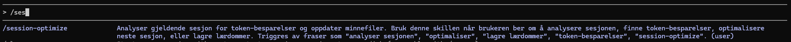

# session-optimizer

A Claude Code skill that analyzes your AI session after the fact, identifies redundant steps, and updates your memory files with shortcuts — so the next time you run the same operation, Claude uses fewer tokens.



## How it works

When you invoke `/session-optimize`, Claude:

1. Runs a Python script that reads and compresses the current session's JSONL transcript
2. Analyzes the transcript in-session (no external API key needed)
3. Identifies which tool calls were redundant or could have been skipped
4. Proposes memory file updates with concrete shortcuts
5. Writes the approved updates to `~/.claude/memory/`

The memory files are automatically loaded in future sessions, so Claude skips the discovery steps it already knows the answers to.

## Installation

**Requirements:** Python 3.11+, Claude Code

**1. Clone the repo**
```bash
git clone https://github.com/Frodetv/session-optimizer.git
cd session-optimizer
```

**2. Install the skill**

PowerShell:
```powershell
.\install.ps1
```

Or manually copy `SKILL.md` to your Claude skills folder:
```
~/.claude/skills/session-optimize/SKILL.md
```

**3. Restart Claude Code** to activate the skill.

## Usage

Run `/session-optimize` at the end of any session where you performed a repeatable operation (e.g. filling in release notes, creating test cases, tagging a release).

```
/session-optimize
```

Claude will present the analysis and ask for confirmation before writing anything to disk.

To analyze a specific session file instead of the latest:
```bash
python session_optimizer.py --session ~/.claude/projects/<project>/<session-id>.jsonl
```

## What gets saved

Learnings are saved as Markdown files in `~/.claude/projects/<project>/memory/` following the standard Claude Code memory format. Each file includes a frontmatter slug and description so Claude can decide when to load it.

Example output for a "fill in release notes" operation:

```
Direkte filsti (skip grep):
- kliniske-verktoy/arena-eyecare-diabetisk-retinopati.md

DeliveryArtifact = retinaintegration
ProductName = Arena Diabetisk retinopati
Relevant kode: src/RetinaIntegration/Forms/
```

## Files

| File | Purpose |
|------|---------|
| `session_optimizer.py` | Reads and compresses the session JSONL transcript |
| `SKILL.md` | Claude Code skill definition |
| `install.ps1` | Copies SKILL.md to `~/.claude/skills/` |
| `pyproject.toml` | Project metadata |
